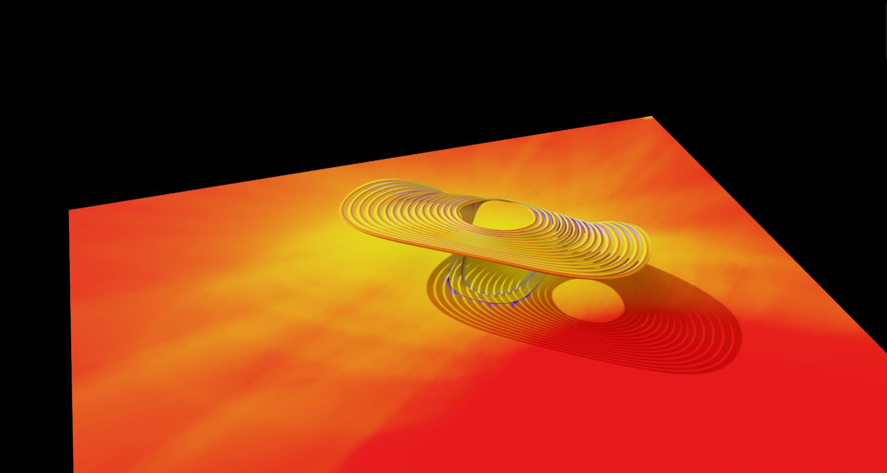

# Warp Daylight

GPU-accelerated direct sunlight analysis for 3D meshes, powered by [NVIDIA Warp](https://github.com/NVIDIA/warp) and exposed through a FastAPI REST API.

Send mesh data in a USD-like format and receive per-vertex or per-face sunlight hours plus optional RGB colours for visualisation in any DCC tool (Maya, Blender, Omniverse, Rhino, etc.).

<!--  -->

## Installation

Developed and Tested on Python 3.13 and Cuda Toolkit 12.8, Driver 13.0

1. Create and activate a virtual environment:

```bash
python -m venv WarpEnv

# Windows
WarpEnv\Scripts\activate

# Linux / Mac
source WarpEnv/bin/activate
```

2. Install dependencies:

```bash
pip install -r requirements.txt
```

## Configuration

Server settings are loaded from environment variables or a `.env` file in the project root. Copy the example file to get started:

```bash
cp .env.example .env
```

All variables use the `DAYLIGHT_` prefix:

| Variable | Default | Description |
|---|---|---|
| `DAYLIGHT_HOST` | `127.0.0.1` | Bind address. Use `0.0.0.0` to open to the local network. |
| `DAYLIGHT_PORT` | `8000` | Port the server listens on. |
| `DAYLIGHT_RELOAD` | `false` | Auto-reload on code changes (development convenience). |
| `DAYLIGHT_LOG_LEVEL` | `info` | Uvicorn log level (`debug`, `info`, `warning`, `error`, `critical`). |

Precedence (highest to lowest): environment variables > `.env` file > defaults above.

## Running the API Server

Use the included start scripts, which activate the virtual environment and read settings from `.env`:

```powershell
# Windows (PowerShell)
.\start_server.ps1

# Windows (cmd)
start_server.bat
```

Or run directly:

```bash
python -m app.main
```

Interactive API docs are then available at `http://localhost:8000/docs`.

## Project Structure

```
Warp_Daylight/
├── app/                        # FastAPI application
│   ├── main.py                 # App entry point, CORS, health endpoint
│   ├── core/
│   │   └── config.py           # Server settings (pydantic-settings)
│   ├── models/
│   │   ├── mesh.py             # USD-like MeshData Pydantic model
│   │   ├── requests.py         # Request body models
│   │   └── responses.py        # Response body models
│   ├── routers/
│   │   ├── analyze.py          # /analyze/* endpoints (JSON + NPZ)
│   │   └── sun.py              # /sun-vectors endpoint
│   └── services/
│       ├── analysis.py         # Orchestrates sun vectors + raycasting
│       └── mesh_processing.py  # USD-like input → numpy arrays
├── src/                        # Core computation (NVIDIA Warp)
│   ├── raycast/
│   │   └── direct_sunlight.py  # GPU raycasting kernels
│   ├── utils/
│   │   ├── sun_vectors.py      # Ladybug sun position calculation
│   │   ├── mesh_utils.py       # Normals, centroids
│   │   ├── color.py            # Value → RGB gradient
│   │   └── visualization.py    # 3D scene helpers
│   ├── viz/
│   │   └── mesh.py             # Mesh visualization utilities
│   └── IO/
│       ├── load_obj.py         # OBJ mesh loader
│       └── load_usd.py         # USD mesh loader
├── tests/
│   ├── warp/                   # Warp computation examples/benchmarks
│   └── api/                    # FastAPI endpoint tests
├── data/meshes/                # Sample mesh files (gitignored)
├── .env.example                # Default configuration template
├── start_server.ps1            # PowerShell start script
├── start_server.bat            # Windows cmd start script
└── requirements.txt
```

## API Endpoints

All `/analyze/*` endpoints are available in two forms:

| Family | Content-Type | Best for |
|---|---|---|
| `/analyze/*` (JSON) | `application/json` | Small-medium meshes, quick testing |
| `/analyze/*/numpy` (NPZ) | `multipart/form-data` | Large meshes (>50k vertices/faces) |

Both families return the same JSON response shape. See [Performance: JSON vs NPZ](#performance-json-vs-npz) for guidance on when to use which.

### `GET /health`

Health check. Returns GPU availability and Warp initialisation status.

```bash
curl http://localhost:8000/health
```

```json
{"status": "ok", "gpu_available": true, "warp_initialized": true}
```

### `POST /analyze/vertices`

Compute annual direct sunlight hours per **vertex**. The mesh acts as both the occlusion geometry and the analysis target.

```bash
curl -X POST http://localhost:8000/analyze/vertices \
  -H "Content-Type: application/json" \
  -d '{
    "mesh": {
      "points": [[0,0,0],[1,0,0],[1,0,1],[0,0,1]],
      "face_vertex_counts": [3, 3],
      "face_vertex_indices": [0,1,2, 0,2,3],
      "normals": [[0,1,0],[0,1,0],[0,1,0],[0,1,0]]
    },
    "sun": {
      "latitude": 40.7128,
      "longitude": -74.006,
      "timezone": "America/New_York",
      "coordinate_system": "y_up",
      "start_datetime": "2024-06-21T06:00:00",
      "end_datetime": "2024-06-21T20:00:00",
      "time_step_minutes": 60
    },
    "options": {
      "use_backface_culling": false,
      "return_colors": true
    }
  }'
```

### `POST /analyze/faces`

Same as above but computes sunlight at **face centroids**. Backface culling is enabled by default and recommended for face-based analysis.

### `POST /analyze/vertices/separate`

Compute sunlight at explicit **target vertices** while using a separate mesh as occlusion geometry.

```bash
curl -X POST http://localhost:8000/analyze/vertices/separate \
  -H "Content-Type: application/json" \
  -d '{
    "blocking_mesh": {
      "points": [[0,0,0],[10,0,0],[10,10,0],[0,10,0]],
      "face_vertex_counts": [3, 3],
      "face_vertex_indices": [0,1,2, 0,2,3]
    },
    "target_points": [[5.0, 0.1, 0.0]],
    "target_normals": [[0.0, 1.0, 0.0]],
    "sun": {
      "latitude": 40.7128,
      "longitude": -74.006,
      "timezone": "America/New_York",
      "year": 2024,
      "time_step_hours": 1
    }
  }'
```

### `POST /analyze/faces/separate`

Compute sunlight at **face centroids of a target mesh** while using a different mesh as occlusion geometry.

### `POST /analyze/vertices/numpy`

Same as `/analyze/vertices` but accepts the mesh as a binary **NPZ file upload** for faster parsing on large meshes. The `sun_config` and `options` parameters are passed as JSON strings in form fields.

```bash
curl -X POST http://localhost:8000/analyze/vertices/numpy \
  -F "mesh_npz=@mesh.npz" \
  -F 'sun_config={"latitude":40.7128,"longitude":-74.006,"timezone":"America/New_York","year":2024,"time_step_hours":1}' \
  -F 'options={"use_backface_culling":true,"return_colors":true}'
```

NPZ archive keys: `points` (V,3 float32), `face_vertex_counts` (F, int32), `face_vertex_indices` (flat int32), and optionally `normals` (V,3 float32).

### `POST /analyze/faces/numpy`

Same as `/analyze/faces` but accepts the mesh as a binary NPZ upload.

### `POST /analyze/vertices/separate/numpy`

Same as `/analyze/vertices/separate` but accepts binary NPZ uploads. Requires two files: `blocking_mesh_npz` (mesh keys as above) and `targets_npz` (keys: `target_points` (N,3), `target_normals` (N,3)).

### `POST /analyze/faces/separate/numpy`

Same as `/analyze/faces/separate` but accepts binary NPZ uploads. Requires two files: `blocking_mesh_npz` and `target_mesh_npz` (both with mesh keys as above).

### `POST /sun-vectors`

Utility endpoint that returns sun direction vectors for a given location/time without running any raycasting.

```bash
curl -X POST http://localhost:8000/sun-vectors \
  -H "Content-Type: application/json" \
  -d '{
    "sun": {
      "latitude": 40.7128,
      "longitude": -74.006,
      "timezone": "America/New_York",
      "coordinate_system": "z_up",
      "start_datetime": "2024-06-21T06:00:00",
      "end_datetime": "2024-06-21T20:00:00",
      "time_step_minutes": 30
    }
  }'
```

Response:

```json
{
  "vectors": [
    {"direction": [-0.123, -0.456, -0.881], "timestamp": "2024-06-21T08:00:00"}
  ],
  "total_count": 1,
  "coordinate_system": "z_up"
}
```

## Response Schema

### Analysis Response (`/analyze/*`)

All analysis endpoints return the same JSON structure:

| Field | Type | Description |
|---|---|---|
| `sunlight_hours` | `[float, ...]` | Direct sunlight hours per element (vertex or face). |
| `hit_counts` | `[int, ...]` | Number of sun directions blocked (occluded) per element. |
| `total_sun_positions` | `int` | Total sun positions tested. |
| `max_possible_hours` | `float` | Maximum theoretically possible sunlight hours. |
| `colors` | `[[R,G,B], ...]` or `null` | Per-element RGB colours (0-255). `null` if `return_colors` was `false`. |
| `metadata` | `object` | See below. |

**`metadata` fields:**

| Field | Type | Description |
|---|---|---|
| `computation_time_seconds` | `float` | Wall-clock time for the GPU raycast (seconds). |
| `num_elements` | `int` | Number of vertices or faces analysed. |
| `num_sun_positions` | `int` | Number of sun direction vectors used. |
| `mesh_vertex_count` | `int` | Total vertices in the blocking mesh. |
| `mesh_face_count` | `int` | Total triangulated faces in the blocking mesh. |

### Sun Vectors Response (`/sun-vectors`)

| Field | Type | Description |
|---|---|---|
| `vectors` | `[{direction, timestamp}, ...]` | Sun direction vectors with ISO-8601 timestamps. |
| `total_count` | `int` | Number of sun positions returned. |
| `coordinate_system` | `string` | `"y_up"` or `"z_up"`. |

## Analysis Options

All analysis endpoints accept an optional `options` object with the following fields:

| Field | Type | Default | Description |
|---|---|---|---|
| `offset_distance` | `float` | `0.001` | Ray origin offset along surface normal to avoid self-intersection (metres). |
| `chunk_size` | `int` | `1000` | Max sun directions per GPU kernel launch. `0` = no chunking. Tune based on available VRAM. |
| `use_backface_culling` | `bool` | `true` | Treat back-facing surfaces as occluded. |
| `return_colors` | `bool` | `true` | Include pre-computed RGB gradient colours in response. |
| `color_gradient` | `[[R,G,B], ...]` or `null` | `null` | Custom gradient (at least 2 colours). Defaults to a blue-to-red sunlight gradient. |

## Python Client Example

### JSON (small meshes)

```python
import requests

response = requests.post("http://localhost:8000/analyze/faces", json={
    "mesh": {
        "points": [[0,0,0],[1,0,0],[1,0,1],[0,0,1]],
        "face_vertex_counts": [3, 3],
        "face_vertex_indices": [0,1,2, 0,2,3],
    },
    "sun": {
        "latitude": 40.7128,
        "longitude": -74.006,
        "timezone": "America/New_York",
        "year": 2024,
        "time_step_hours": 1,
    },
    "options": {
        "use_backface_culling": True,
        "return_colors": True,
    },
})

data = response.json()
print(f"Sunlight hours: {data['sunlight_hours']}")
print(f"Colors (RGB):   {data['colors']}")
```

### NPZ (large meshes)

```python
import io
import json
import numpy as np
import requests

vertices = np.array([[0,0,0],[1,0,0],[1,0,1],[0,0,1]], dtype=np.float32)
counts = np.array([3, 3], dtype=np.int32)
indices = np.array([0,1,2, 0,2,3], dtype=np.int32)

buf = io.BytesIO()
np.savez(buf, points=vertices, face_vertex_counts=counts, face_vertex_indices=indices)
buf.seek(0)

sun_config = json.dumps({
    "latitude": 40.7128,
    "longitude": -74.006,
    "timezone": "America/New_York",
    "year": 2024,
    "time_step_hours": 1,
})

response = requests.post(
    "http://localhost:8000/analyze/faces/numpy",
    files={"mesh_npz": ("mesh.npz", buf, "application/octet-stream")},
    data={"sun_config": sun_config, "options": json.dumps({"return_colors": True})},
)

data = response.json()
print(f"Sunlight hours: {data['sunlight_hours']}")
print(f"Colors (RGB):   {data['colors']}")
```

## Mesh Input Format (USD-like)

The API accepts meshes using the same attribute names as `UsdGeom.Mesh`:

| Field | Type | Description |
|---|---|---|
| `points` | `[[x,y,z], ...]` | Vertex positions |
| `face_vertex_counts` | `[int, ...]` | Vertices per face (3 or 4) |
| `face_vertex_indices` | `[int, ...]` | Flat vertex index list |
| `normals` | `[[nx,ny,nz], ...]` or `null` | Per-vertex normals (auto-computed if omitted) |

Quads are automatically triangulated via fan triangulation.

For the NPZ endpoints, the same keys are expected inside the `.npz` archive as contiguous numpy arrays (`float32` for points/normals, `int32` for counts/indices).

## Coordinate Systems

| Software | Setting |
|---|---|
| Maya, USD, Omniverse | `"y_up"` (default) |
| Rhino, Grasshopper, Ladybug | `"z_up"` |

## Performance: JSON vs NPZ

For large meshes, the JSON endpoints spend significant time parsing nested Python lists and validating them through Pydantic. The NPZ endpoints bypass this by accepting pre-built numpy arrays as a binary upload.

| Aspect | JSON endpoints | NPZ endpoints |
|---|---|---|
| Wire size | ~3-4x larger (text floats) | Compact binary float32/int32 |
| Parse path | JSON decode + Pydantic validation | `np.load` directly into arrays |
| Ease of use | Simple `curl` / `requests.post(json=...)` | Requires building an NPZ archive |
| Recommended for | < 50k vertices/faces, quick testing | > 50k vertices/faces |

By default both families return JSON responses serialised via `orjson`. Add `?response_format=npz` to any endpoint to receive a binary NPZ archive instead (see [Binary NPZ Response](#binary-npz-response) below).

## Binary NPZ Response

All `/analyze/*` endpoints support an optional `response_format` query parameter. Set it to `npz` to receive the analysis results as a binary NPZ archive instead of JSON. This eliminates JSON serialization overhead on the response side, which matters for meshes with hundreds of thousands of elements.

```bash
curl -X POST "http://localhost:8000/analyze/faces?response_format=npz" \
  -H "Content-Type: application/json" \
  -d '{ ... }' \
  -o result.npz
```

Reading the response in Python:

```python
import json
import numpy as np

with np.load("result.npz", allow_pickle=False) as data:
    sunlight_hours = data["sunlight_hours"]   # (N,) float
    hit_counts = data["hit_counts"]           # (N,) int
    colors = data["colors"]                   # (N,3) uint8, if requested

    scalars = json.loads(bytes(data["metadata_json"]))
    print(scalars["total_sun_positions"])
    print(scalars["metadata"]["computation_time_seconds"])
```

The NPZ archive contains:

| Key | Shape | Dtype | Description |
|---|---|---|---|
| `sunlight_hours` | `(N,)` | float | Direct sunlight hours per element. |
| `hit_counts` | `(N,)` | int | Occluded sun directions per element. |
| `colors` | `(N, 3)` | uint8 | RGB colours (present only if `return_colors` was `true`). |
| `metadata_json` | scalar | bytes | JSON blob with `total_sun_positions`, `max_possible_hours`, and `metadata`. |

## Running Tests

```bash
# API endpoint tests (pytest)
python -m pytest tests/api/ -v

# Integration test with Stanford meshes (requires running server)
python tests/api/test_stanford_meshes.py

# Warp computation examples (requires GPU + mesh data)
python tests/warp/example_direct_sunlight_hours.py
python tests/warp/example_direct_sunlight_annual_faces.py
python tests/warp/example_direct_sunlight_annual_vertices.py
python tests/warp/example_direct_sunlight_daily_vertices.py

# GPU chunk-size benchmark
python tests/warp/direct_sunlight_benchmark_chunk_size.py
```

## Roadmap

- [x] Basic loading and visualization
- [x] Direct raycasting with NVIDIA Warp
- [x] Ladybug sun position integration
- [x] Annual daylight exposure
- [x] Face-based analysis with backface culling
- [x] FastAPI REST API
- [x] Binary NPZ upload endpoints for large meshes
- [ ] Replace Ladybug modules for sun vector retrieval
- [ ] EPW file compatibility
- [ ] Daylight comfort with reflection bounces
- [ ] DCC tool UI plugins (Maya, Rhino, Blender, Omniverse)
