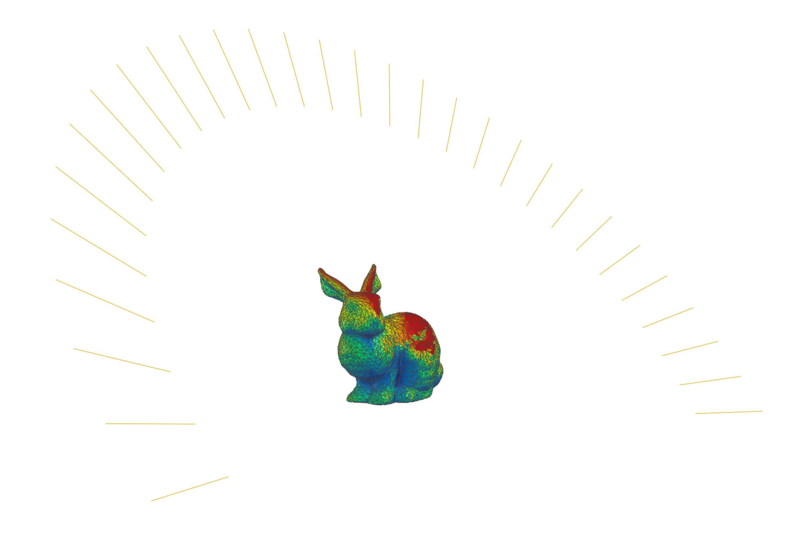

# Warp Daylight

## Description

A short repo for using (Warp by Nvidia)[https://github.com/NVIDIA/warp] for direct sunlight calculations.


## Installation

1. Create a virtual environment:
```bash
python -m venv WarpEnv
```

2. Activate the virtual environment:

**Windows:**
```bash
WarpEnv\Scripts\activate
```

**Linux/Mac:**
```bash
source WarpEnv/bin/activate
```

3. Install dependencies:
```bash
pip install -r requirements.txt
```

## Activating the Virtual Environment

**Windows:**
```bash
WarpEnv\Scripts\activate
```

**Linux/Mac:**
```bash
source WarpEnv/bin/activate
```

To deactivate the virtual environment, simply run:
```bash
deactivate
```

5. TO DO

- [x] Implement basic loading and visualization
- [x] Implement basic direct raycasting
- [x] Test and improve the raycasting
- [x] Combine with ray directions from ladybug
- [ ] Test annual daylight expose implementation
- [ ] Implement also with face centers and face normals not only vertex normals
- [ ] Add to work with EPW files
- [ ] Add fast API for hosting warp environment



