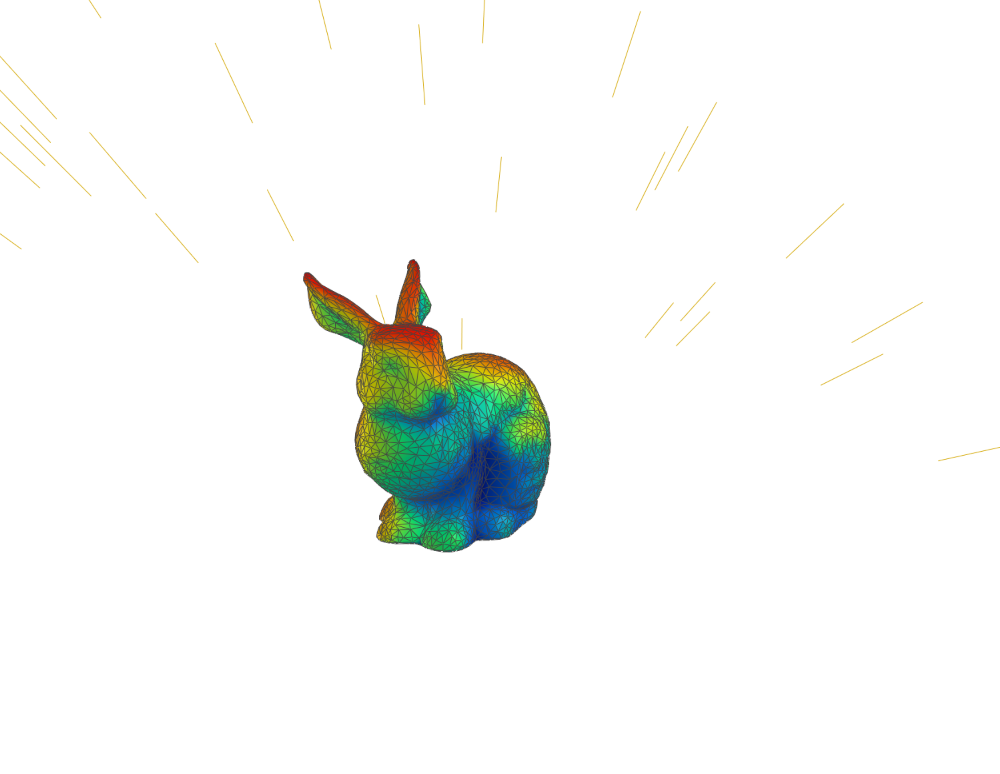

# Warp Daylight

GPU-accelerated direct sunlight analysis for 3D meshes, powered by [NVIDIA Warp](https://github.com/NVIDIA/warp) and exposed through a FastAPI REST API.

Send mesh data in a USD-like format and receive per-vertex or per-face sunlight hours plus optional RGB colours for visualisation in any DCC tool (Maya, Blender, Omniverse, Rhino, etc.).



## Installation

Developed and Tested on Python 3.13 and Cuda Toolkit 12.8, Driver 13.0

1. Create and activate a virtual environment:

```bash
python -m venv WarpEnv

# Windows
WarpEnv\Scripts\activate

# Linux / Mac
source WarpEnv/bin/activate
```

2. Install dependencies:

```bash
pip install -r requirements.txt
```

## Running the API Server

```bash
uvicorn app.main:app --host 0.0.0.0 --port 8000
```

Interactive API docs are then available at `http://localhost:8000/docs`.

## Project Structure

```
Warp_Daylight/
├── app/                        # FastAPI application
│   ├── main.py                 # App entry point, CORS, health endpoint
│   ├── models/
│   │   ├── mesh.py             # USD-like MeshData Pydantic model
│   │   ├── requests.py         # Request body models
│   │   └── responses.py        # Response body models
│   ├── routers/
│   │   ├── analyze.py          # /analyze/* endpoints
│   │   └── sun.py              # /sun-vectors endpoint
│   └── services/
│       ├── analysis.py         # Orchestrates sun vectors + raycasting
│       └── mesh_processing.py  # USD-like input → numpy arrays
├── src/                        # Core computation (NVIDIA Warp)
│   ├── raycast/
│   │   └── direct_sunlight.py  # GPU raycasting kernels
│   ├── utils/
│   │   ├── sun_vectors.py      # Ladybug sun position calculation
│   │   ├── mesh_utils.py       # Normals, centroids
│   │   ├── color.py            # Value → RGB gradient
│   │   └── visualization.py    # 3D scene helpers
│   └── IO/
│       ├── load_obj.py         # OBJ mesh loader
│       └── load_usd.py         # USD mesh loader
├── tests/
│   ├── warp/                   # Warp computation examples/benchmarks
│   └── api/                    # FastAPI endpoint tests
├── data/meshes/                # Sample mesh files (gitignored)
└── requirements.txt
```

## API Endpoints

### `GET /health`

Health check. Returns GPU availability and Warp initialisation status.

```bash
curl http://localhost:8000/health
```

```json
{"status": "ok", "gpu_available": true, "warp_initialized": true}
```

### `POST /analyze/vertices`

Compute annual direct sunlight hours per **vertex**. The mesh acts as both the occlusion geometry and the analysis target.

```bash
curl -X POST http://localhost:8000/analyze/vertices \
  -H "Content-Type: application/json" \
  -d '{
    "mesh": {
      "points": [[0,0,0],[1,0,0],[1,0,1],[0,0,1]],
      "face_vertex_counts": [3, 3],
      "face_vertex_indices": [0,1,2, 0,2,3],
      "normals": [[0,1,0],[0,1,0],[0,1,0],[0,1,0]]
    },
    "sun": {
      "latitude": 40.7128,
      "longitude": -74.006,
      "timezone": "America/New_York",
      "coordinate_system": "y_up",
      "start_datetime": "2024-06-21T06:00:00",
      "end_datetime": "2024-06-21T20:00:00",
      "time_step_minutes": 60
    },
    "options": {
      "use_backface_culling": false,
      "return_colors": true
    }
  }'
```

### `POST /analyze/faces`

Same as above but computes sunlight at **face centroids**. Backface culling is recommended for face-based analysis.

### `POST /analyze/vertices/separate`

Compute sunlight at explicit **target vertices** while using a separate mesh as occlusion geometry.

```bash
curl -X POST http://localhost:8000/analyze/vertices/separate \
  -H "Content-Type: application/json" \
  -d '{
    "blocking_mesh": {
      "points": [[0,0,0],[10,0,0],[10,10,0],[0,10,0]],
      "face_vertex_counts": [3, 3],
      "face_vertex_indices": [0,1,2, 0,2,3]
    },
    "target_points": [[5.0, 0.1, 0.0]],
    "target_normals": [[0.0, 1.0, 0.0]],
    "sun": {
      "latitude": 40.7128,
      "longitude": -74.006,
      "timezone": "America/New_York",
      "year": 2024,
      "time_step_hours": 1
    }
  }'
```

### `POST /analyze/faces/separate`

Compute sunlight at **face centroids of a target mesh** while using a different mesh as occlusion geometry.

### `POST /sun-vectors`

Utility endpoint that returns sun direction vectors for a given location/time without running any raycasting.

```bash
curl -X POST http://localhost:8000/sun-vectors \
  -H "Content-Type: application/json" \
  -d '{
    "sun": {
      "latitude": 40.7128,
      "longitude": -74.006,
      "timezone": "America/New_York",
      "coordinate_system": "z_up",
      "start_datetime": "2024-06-21T06:00:00",
      "end_datetime": "2024-06-21T20:00:00",
      "time_step_minutes": 30
    }
  }'
```

## Python Client Example

```python
import requests

response = requests.post("http://localhost:8000/analyze/faces", json={
    "mesh": {
        "points": [[0,0,0],[1,0,0],[1,0,1],[0,0,1]],
        "face_vertex_counts": [3, 3],
        "face_vertex_indices": [0,1,2, 0,2,3],
    },
    "sun": {
        "latitude": 40.7128,
        "longitude": -74.006,
        "timezone": "America/New_York",
        "year": 2024,
        "time_step_hours": 1,
    },
    "options": {
        "use_backface_culling": True,
        "return_colors": True,
    },
})

data = response.json()
print(f"Sunlight hours: {data['sunlight_hours']}")
print(f"Colors (RGB):   {data['colors']}")
```

## Mesh Input Format (USD-like)

The API accepts meshes using the same attribute names as `UsdGeom.Mesh`:

| Field | Type | Description |
|---|---|---|
| `points` | `[[x,y,z], ...]` | Vertex positions |
| `face_vertex_counts` | `[int, ...]` | Vertices per face (3 or 4) |
| `face_vertex_indices` | `[int, ...]` | Flat vertex index list |
| `normals` | `[[nx,ny,nz], ...]` or `null` | Per-vertex normals (auto-computed if omitted) |

Quads are automatically triangulated via fan triangulation.

## Coordinate Systems

| Software | Setting |
|---|---|
| Maya, USD, Omniverse | `"y_up"` (default) |
| Rhino, Grasshopper, Ladybug | `"z_up"` |

## Running Tests

```bash
# API endpoint tests
python -m pytest tests/api/ -v

# Warp computation examples (requires GPU + mesh data)
python tests/warp/example_direct_sunlight_hours.py
python tests/warp/example_direct_sunlight_annual_faces.py
```

## Roadmap

- [x] Basic loading and visualization
- [x] Direct raycasting with NVIDIA Warp
- [x] Ladybug sun position integration
- [x] Annual daylight exposure
- [x] Face-based analysis with backface culling
- [x] FastAPI REST API
- [ ] EPW file compatibility
- [ ] Daylight comfort with reflection bounces
